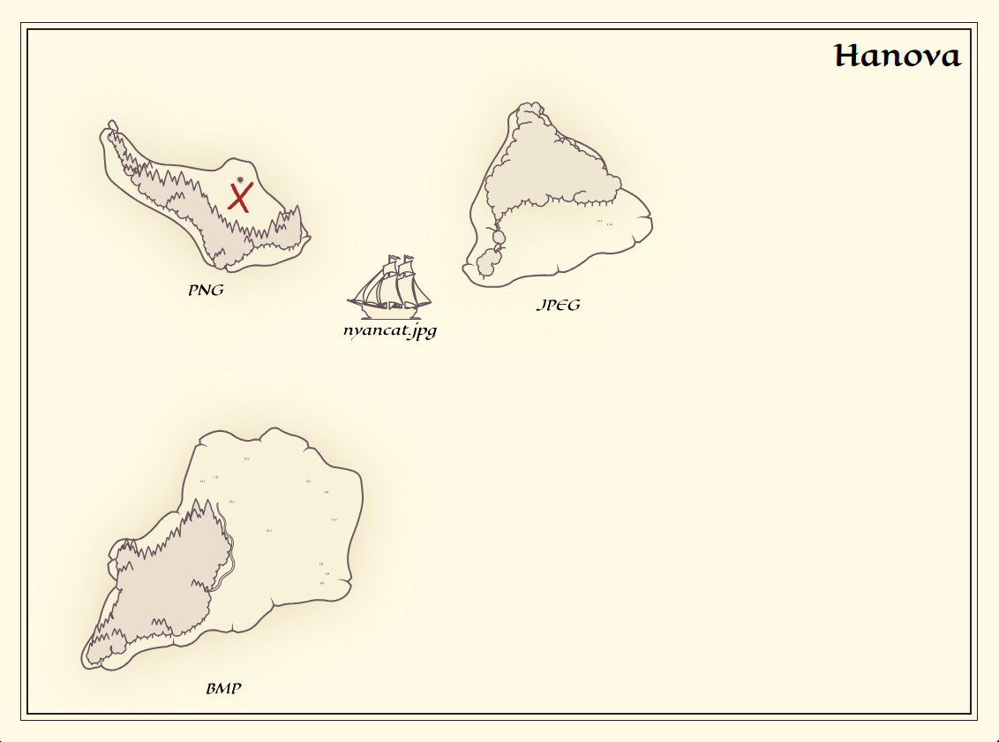

# Hanova

Hanova is a file conversion website with a nautical twist!

[](https://thestarviper.github.io/hanova/)

Welcome to Hanova, a (fictional) archipelago off the coast of Madagascar!
"Hanova" is the Malagasy word for "convert", and that's exactly what these
islands do. Drag-and-drop your file into the water, and sail it to the island
corresponding to your desired file format. Dig at the red X, and you'll unearth
buried **treasure**: your converted file!

> [!NOTE]
> Hanova is still under heavy development. It is in a functional state now, but
> it isn't feature-complete, and there may be bugs. A lot of bugs.

## Demo

> [!TIP]
> **<https://thestarviper.github.io/hanova/>**

## Backend (C++)

For the backend I(Andrew) have decided to use C++ as it is the language I'm the
most familar with. I compiled the backend through emscripten to a wasm package
paired with js and ts helper files so that Ethan can do the frontend more
seamlessly. There are a ton of file conversion libraries that exist already and
it would take an unreasonable amount of time to develop my own with the codecs
and such so i opted for a prepackaged library. I have listed the libraries ive
used down below, but before that, even though i used libraries for conversion
there are still a ton of other things to do other than calling functions in the
library that a file converter like file validation and safety functions.

### Libraries Used:

- stb_image (png,jpeg,bmp,tga,hdr)

### Supported File Formats

<details>
<summary><h3>Images</h3></summary>

- [x] png
- [x] jpeg
- [x] bmp
- [x] tga
- [x] hdr
- [ ] ico (in progress)
- [ ] gif
- [ ] webp (in progress)
- [ ] tiff
- [ ] avif
- [ ] heif
- [ ] heic
- [ ] svg
- [ ] eps

</details>

<details>
<summary><h3>Audio</h3></summary>

- [ ] mp3
- [ ] wav
- [ ] flac
- [ ] ogg
- [ ] aac
- [ ] m4a
- [ ] opus
- [ ] wma
- [ ] aiff
- [ ] alac
- [ ] amr
- [ ] ac3

</details>

<details>
<summary><h3>Docs</h3></summary>

- [ ] pdf
- [ ] txt
- [ ] md
- [ ] rtf
- [ ] doc
- [ ] docx
- [ ] html
- [ ] epub
- [ ] pptx
- [ ] csv
- [ ] odt
- [ ] xls

</details>

<details>
<summary><h3>3D files</h3></summary>

- [ ] obj
- [ ] fbx
- [ ] stl
- [ ] step
- [ ] glb
- [ ] blend

</details>

<details>
<summary><h3>Video</h3></summary>

Video conversion locally has no access to hardware accelleration so we are
unable to do it reasonably without an external server. In the future we may
dable with the idea of making video formats available via self hosted docker
container.

</details>

## Frontend (Svelte)

There are a [lot](https://vert.sh/) [of](https://www.freeconvert.com/)
[file](https://convertio.co/) [converters](https://cloudconvert.com/)
[online](https://www.convertfiles.com/), and most of them have the same
aesthetic: a sleek modern webpage with a small box to drop files into and a
dropdown to select the target format. Well that's boring! It would be much more
fun if the whole website was styled as an antique nautical map.

The current version of the frontend is ~~stolen from~~ inspired by
[Perilous Shores](https://watabou.itch.io/perilous-shores) by Watabou, and I
made most of Hanova's assets by extracting them from Perilous Shores exports. We
might change the art direction or use custom assets in the future.

### Planned Features

- [ ] A compass rose that brings you to an About page
- [ ] Boat sinks if the conversion throws an error
- [ ] Boat points in the direction it's moving in
- [ ] Boat spawns at the island corresponding to its original file format
- [ ] Mobile support
- [ ] Boat moves in circles around islands rather than beaching itself
- [ ] Map is scrollable (and maybe zoomable)
- [ ] Boat travel animation where it follows an auto-generated dashed line that
      curves around obstacles
- [ ] Smoother animations and an overall better experience
- [ ] procedural island and water generation
- [ ] ...and probably more

## Compiling yourself

Prerequisites:

- [pnpm](https://pnpm.io/installation)
- [emscripten](https://emscripten.org/docs/getting_started/downloads.html)

```sh
# clone the repo
git clone https://github.com/TheStarViper/hanova.git
cd hanova

# regenerate the wasm (optional but recommended)
make -C backend

# start the site
cd frontend
pnpm install
pnpm dev
```

## Acknowledgements

- Thanks to [Watabou](https://github.com/watabou) for making
  [Perilous Shores](watabou.itch.io/perilous-shores), which is the main design
  inspiration, and from which most of the assets are derived (e.g. islands,
  color palette, banner). _Obligatory legal disclaimer: Perilous Shores allows
  its output to be used
  ["as you like: copy, modify, include in your commercial rpg adventures etc. Attribution is appreciated, but not required"](https://watabou.itch.io/perilous-shores#:~:text=You%20can%20use,but%20not%20required.)._
- Thanks to [Sean Barrett](https://github.com/nothings) for making
  [stb](https://github.com/nothings/stb), which is used for the image conversion
  backend.

## Contributors

- Ethan ([@ethmarks](https://github.com/ethmarks)): Frontend in Svelte
- Andrew ([@TheStarViper](https://github.com/TheStarViper)): Backend in C++
