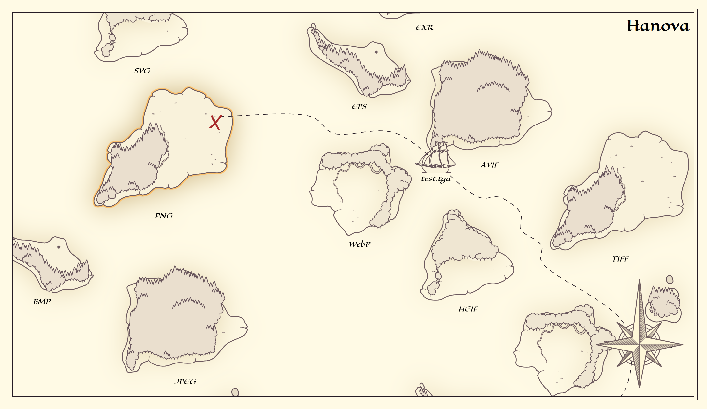
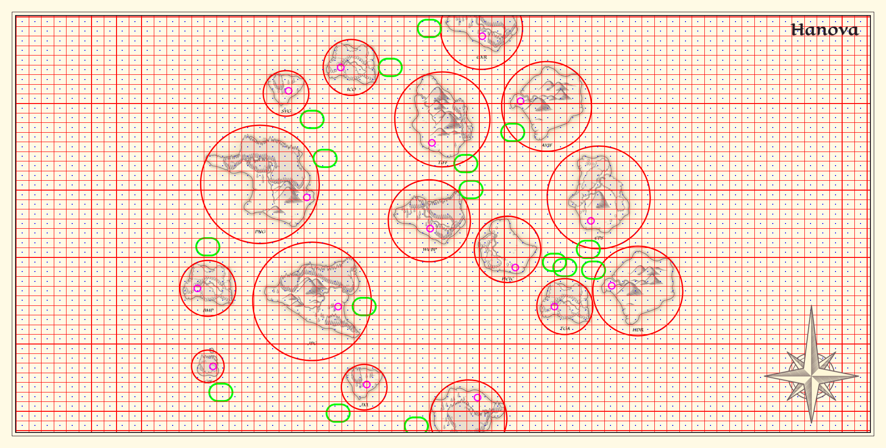

# Hanova

Hanova is a file conversion website with a nautical twist!

[](https://thestarviper.github.io/hanova/)

Welcome to Hanova, a (fictional) archipelago off the coast of Madagascar!
"Hanova" is the Malagasy word for "transform", and that's exactly what these
islands do. Drag-and-drop your file into the water, and sail it to the island
corresponding to your desired file format. Dig at the red X, and you'll unearth
buried **treasure**: your converted file!

> [!NOTE]
> Hanova is still under heavy development. It is in a functional state now, but
> it isn't feature-complete, and there may be bugs. A lot of bugs.

## Demo

> [!TIP]
> **<https://thestarviper.github.io/hanova/>**

## Backend (C++)

For the backend I(Andrew) have decided to use C++ as it is the language I'm the
most familar with. I compiled the backend through emscripten to a wasm package
paired with js and ts helper files so that Ethan can do the frontend more
seamlessly. There are a ton of file conversion libraries that exist already and
it would take an unreasonable amount of time to develop my own with the codecs
and such so i opted for a prepackaged library. I have listed the libraries ive
used down below, but before that, even though i used libraries for conversion
there are still a ton of other things to do other than calling functions in the
library that a file converter like file validation,safety functions,error handling,
and glue code so that they can work seamlessly together

### Libraries Used:

- [stb_image](https://github.com/nothings/stb) (png,jpeg,bmp,tga,hdr)
- [libwebp](https://github.com/webmproject/libwebp) (webp)
- [nanosvg](https://github.com/memononen/nanosvg) (svg)
- [imagemagick](https://github.com/ImageMagick/ImageMagick) (all other image
  formats)
- [mediabunny](https://github.com/Vanilagy/mediabunny) (audio and video)
- [pandoc](https://github.com/jgm/pandoc) (documents)

### Bridge System

Since this file conversion program uses alot of different libraries combined, a notable portion of the backend codebase is glue-code used to make it so that they can work together. We grabbed the WASM versions of programs like imagemagick and pandoc to use and bridged them using MJS, while mediabunny is a TypeScript library so that it can take advantage of hardware acceleration. However, since we had to balance a wide variety of ecosystems, they all had different error formats and spit out different types of errors, so to make things easier we made a unified error system that decoded all of the errors from the various libraries and made human-readable and simplified errors.

### Supported File Formats

<details>
<summary><h3>Images</h3></summary>

- [x] png
- [x] jpeg
- [x] bmp
- [x] tga
- [x] hdr
- [x] ico
- [x] gif
- [x] exr
- [x] webp
- [x] avif
- [x] svg
- [x] eps
- [x] ai (adobe illustrator not artificial intellegence)
- [x] qoi
- [x] tiff
- [x] jxl
- [x] psd

</details>

<details>
<summary><h3>Audio</h3></summary>

- [x] mp3
- [x] wav
- [x] flac
- [x] ogg
- [x] aac
- [x] m4a
- [ ] opus
- [ ] wma
- [ ] aiff
- [ ] alac
- [ ] amr
- [ ] ac3

</details>

<details>
<summary><h3>Docs</h3></summary>

- [ ] pdf
- [ ] txt
- [ ] md
- [ ] rtf
- [ ] doc
- [ ] docx
- [ ] html
- [ ] epub
- [ ] pptx
- [ ] csv
- [ ] odt
- [ ] xls

</details>

<details>
<summary><h3>Video</h3></summary>

- [x] mp4
- [x] mkv
- [x] webm
- [x] mov
- [x] m4s
- [x] ts (MPEG Transport stem)
- [x] m3u8 (HLS)

</details>
3D Files:

- [ ] obj
- [ ] fbx
- [ ] stl
- [ ] step
- [ ] glb
- [ ] blend


## Frontend (Svelte)

There are a [lot](https://vert.sh/) [of](https://www.freeconvert.com/)
[file](https://convertio.co/) [converters](https://cloudconvert.com/)
[online](https://www.convertfiles.com/), and most of them have the same
aesthetic: a sleek modern webpage with a small box to drop files into and a
dropdown to select the target format. Well that's boring! It would be much more
fun if the whole website was styled as an antique nautical map.

The current design of the frontend is ~~stolen from~~ inspired by
[Perilous Shores](https://watabou.itch.io/perilous-shores) by Watabou, and I
made most of Hanova's assets by extracting them from Perilous Shores exports. We
might change the art direction or use custom assets in the future.

### Pathfinding



The boat uses the A* algorithm to pathfind from its current position to the
target island without clipping through any other islands. The generated path is
then converted to centripetal Catmull-Rom splines, converted to cubic Beziers,
and then used to animate the boat's travel and draw the dashed line.

### Frontend Roadmap

Week 1:

- [x] Page layout inspired by Perilous Shores
- [x] Boat that can move between islands
- [x] 3 islands that trigger a file conversion when clicked
- [x] File uploading and downloading

Week 2:

- [x] About page
- [x] Decorative compass rose (that links to the about page)
- [x] A* pathfinding between islands
- [x] Boat travels along route
- [x] Dashed line that displays route

Week 3:

- [x] Viewport panning
- [x] Boat sinks if the conversion fails
- [x] Sound effects
- [x] Boat spawns at the island corresponding to its original file format
- [x] 19 islands

Week 4:

- [x] Viewport zooming
- [x] More island asset variety
- [x] Improved title screen
- [x] Pathfinding algorithm improvements
- [x] Tooltips

Planned:

- [ ] Mobile support
- [ ] Boat moves in circles around islands rather than beaching itself
- [ ] Smoother animations and an overall better experience
- [ ] Procedural island and water generation
- [ ] ...and probably more

</details>

## Compiling yourself

Prerequisites:

- [pnpm](https://pnpm.io/installation)
- [emscripten](https://emscripten.org/docs/getting_started/downloads.html)

```sh
# clone the repo
git clone https://github.com/TheStarViper/hanova.git
cd hanova

# regenerate the wasm (optional but recommended)
make -C backend

# start the site
cd frontend
pnpm install
pnpm dev
```

## Acknowledgements

- Thanks to [Watabou](https://github.com/watabou) for making
  [Perilous Shores](watabou.itch.io/perilous-shores), which is the main design
  inspiration, and from which most of the assets are derived (e.g. islands,
  color palette, banner). _Obligatory legal disclaimer: Perilous Shores allows
  its output to be used
  ["as you like: copy, modify, include in your commercial rpg adventures etc."](https://watabou.itch.io/perilous-shores#:~:text=You%20can%20use,rpg%20adventures%20etc.)_
- Thanks to [Sean Barrett](https://github.com/nothings) for making
  [stb](https://github.com/nothings/stb), which is used for the image conversion
  backend.

## Contributors

- Ethan ([@ethmarks](https://github.com/ethmarks)): Frontend in Svelte
- Andrew ([@TheStarViper](https://github.com/TheStarViper)): Backend in C++